# Yolo Model Analysis

## Reproducing Results

### Dataset Setup

Download the VisDrone 2019 Object Detection dataset from the [official VisDrone repository](https://github.com/VisDrone/VisDrone-Dataset). You need the three splits:

- `VisDrone2019-DET-train`
- `VisDrone2019-DET-val`
- `VisDrone2019-DET-test-dev`

### Training

All training is driven by YAML config files in [training/](training/). Open [training/yolo_train.ipynb](training/yolo_train.ipynb) in Colab or Jupyter and set `ARGS_YAML_PATH` to the config for the run you want to reproduce. Update `TRAIN_DIR_RAW`, `VAL_DIR_RAW`, `TEST_DIR_RAW`, and `DST_DIR` to match your local or Drive paths. The notebook will convert the VisDrone annotations to YOLO format, train the model, and save results.

| Run | Config |
|---|---|
| Baseline | [training/baseline.yaml](training/baseline.yaml) |
| AdamW lr=0.001 | [training/experiment/adamw_lr0_001.yaml](training/experiment/adamw_lr0_001.yaml) |
| Data Augmentation | [training/experiment/data_augmentation.yaml](training/experiment/data_augmentation.yaml) |
| High Resolution (1280) | [training/experiment/imgsize_high.yaml](training/experiment/imgsize_high.yaml) |
| AdamW lr=0.001 + High Res | [training/improvement_cycle/adamw_lr0_001_imghigh.yaml](training/improvement_cycle/adamw_lr0_001_imghigh.yaml) |
| Data Aug + High Res | [training/improvement_cycle/data_aug_imghigh.yaml](training/improvement_cycle/data_aug_imghigh.yaml) |
| More Epochs (75) | [training/improvement_cycle/imgsize_high_more_epochs.yaml](training/improvement_cycle/imgsize_high_more_epochs.yaml) |
| Cosine LR + High Res | [training/improvement_cycle/cosine_lr_imghigh.yaml](training/improvement_cycle/cosine_lr_imghigh.yaml) |
| YOLOv8s | [training/verisoned/yolov8.yaml](training/verisoned/yolov8.yaml) |
| YOLOv9s | [training/verisoned/yolov9.yaml](training/verisoned/yolov9.yaml) |
| YOLOv10s | [training/verisoned/yolov10.yaml](training/verisoned/yolov10.yaml) |

### Analysis

After training, run the analysis notebooks in [analyze/](analyze/) to reproduce plots and rankings:

- [analyze/plot_training_curves.ipynb](analyze/plot_training_curves.ipynb): training and validation loss curves
- [analyze/evaluate_models.ipynb](analyze/evaluate_models.ipynb): test set evaluation and rankings
- [analyze/compare_baseline_versioned.ipynb](analyze/compare_baseline_versioned.ipynb): versioned model comparison

--

## Goal

The goal of this project is to analyze the You Only Look Once (YOLO) model family provided by Ultralytics on an object detection task. This repo first trains a baseline, Yolov11 model, benchmarks different iterations, and analyzes different Yolo versions (8,9,10). For training time's sake, the Yolov11 small size (9m parameters) was used.

## Dataset

The dataset that was used in this project was the VisDrone dataset provided by the AISKYEYE team at the Lab of Machine Learning and Data Mining, Tianjin University, China. VisDrone is a collection of bound box-annotated drone-captured images and videos across urban and rural China.

This dataset is widely used in the field of computer vision as it is a rigorously annotated, large, and diverse dataset that contains many different data types (static images, videos, single and multi-object tracking). This repo focuses on task 1 on the dataset, or object detection in images, which contains 6,471 training, 548 validation, and 1,610 test images.

## Training Environment

All models were trained on an A100 GPU within Google Colab.

## Usage Instructions

## Baseline Model

The baseline Yolov11 was trained on VisDrone data. Default parameters were used to train the model. Here are the training results:

### Training and Validation Loss

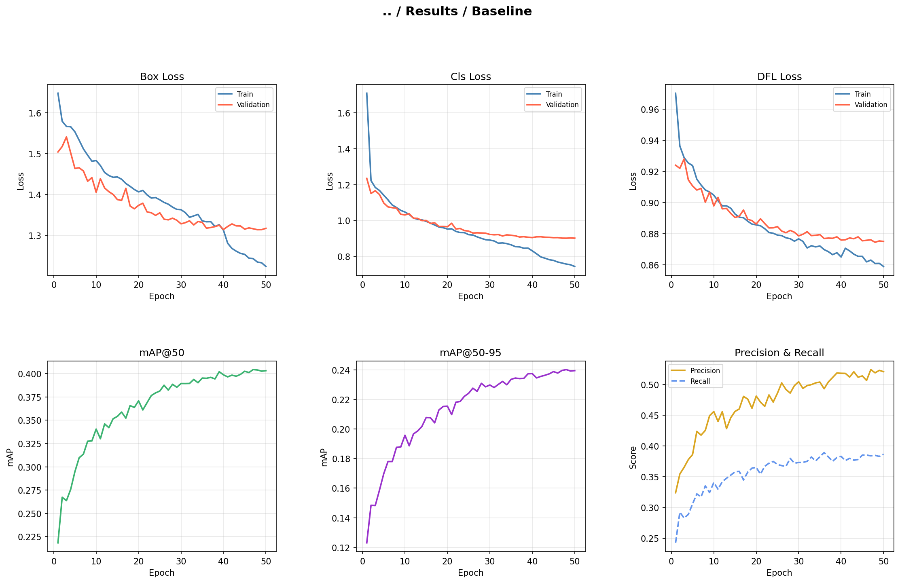

| Metric | Best Validation | Test Set |
|---|---|---|
| mAP@50-95 | 0.2402 | 0.1760 |
| mAP@50 | 0.4040 | 0.3120 |
| Precision | 0.5188 | 0.4495 |
| Recall | 0.3848 | 0.3467 |

Overall, the baseline model exhibited healthy training curves. The training and validation losses are decreased across all 50 epochs. Notably, though, after epoch 40, a mild divergence between training and validation in box, class, and DFL loss was observed. This divergence coincided with the removal of mosaic augmentation at epoch 40. With less diverse training data, the model was able to begin memorizing specific features of the training images, causing training loss to fall faster than validation loss.

However, this did not negatively impact detection performance, as mAP@50 continued to improve through to epoch 48. This suggests that the model, despite the loss divergence, still retained strong task generalization.

### Convergence Behavior

This model did not fully converge at 50 epochs. While, as discussed above, there was divergence in training and validation losses, they both were still declining. Also, the metrics of mAP, precision, and recall were still fluctuating and had not settled on a stable value. However, this model was close to convergence. The rate of improvement had slowed dramatically, and the model was deciding on its final values before convergence. Convergence could be squeezed out with around 20-30 more epochs, but the payback would be extremely low.

### Overfitting/Underfitting

Strict overfitting was not observed, as validation loss did not trend upward even as the gap between the two curves widened. Performance gains continued to manifest despite the divergence, suggesting the model was still learning useful features.

While strict overfitting was not observed during training, the drop from a validation mAP@50 of 0.4040 to a test mAP@50 of 0.3112, a relative decline of 23%, suggests the model did not fully generalize to unseen data. While some drop in performance is expected, the decline was substantial. The model may have overfit to the training and validation data, or the validation set may not have been a representative sample of the problem domain. Two factors likely constrained the model's ability to learn more robust representations. First, the VisDrone training set contains only 6,401 images, which is modest for a fine-grained detection task of this complexity; state-of-the-art models would expect to train on datasets of over  200,000 images. With limited data diversity, the model had fewer opportunities to learn features that transfer reliably to new images. Second, the small YOLO model variant has a small parameter count, which may limit its capacity to capture the complex spatial relationships required for detecting small objects in cluttered aerial scenes. Together, these constraints suggest that validation performance may have overstated the model's true generalization ability.

## Experiments

### Specific Optimizer Settings

#### Experiment Settings

The baseline optimizer is AdamW with a learning rate of 0.000714. This experiment increases the learning rate to 0.001.

The rationale for this experiment is that the automatically chosen learning rate might be too conservative. With a higher learning rate, we might converge either faster or explore a new, better, lower minimum.

#### Results

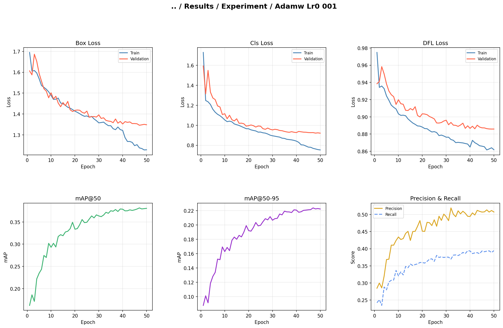

| Metric | Baseline | AdamW lr=0.001 |
|---|---|---|
| mAP@50-95 | 0.1760 | **0.1800** |
| mAP@50 | 0.3120 | **0.3168** |
| Precision | **0.4495** | 0.4443 |
| Recall | 0.3467 | **0.3497** |
| Inference (ms/img) | 5.538 | **5.215** |

#### Analysis

Despite the higher learning rate, the model trailed the baseline loss throughout all of the training. At epoch 10, the baseline had already reached a validation mAP50 of 0.341 while the experiment sat at 0.293. This gap persisted through to epoch 50, where the baseline finished at 0.403 versus 0.381. Rather than converging faster or finding a better minimum, the higher learning rate actually appeared to slow and destabilize early learning.

The experiment produced a test mAP50-95 of 0.1800 versus the baseline's 0.1760, a marginal gain of 0.0040. This improvement is too small to be notable and falls within noise (although further testing will support the idea that the optimizer may consistently lead to small increases). This experiment suggests that the default learning rate was appropriate for this task, and increasing it provided no meaningful benefit.

### Data Augmentation

#### Experiment Settings

Data augmentation is the practice of altering the training data in hopes that the model learns a deeper understanding of the problem rather than memorizing unimportant features. The baseline model already uses the mosaic data augmentation, but this experiment also included the mixup and copy-paste augmentation.

Mixup blends two images together with a weighted average, encouraging the model to produce softer, more generalized predictions. Copy-paste augmentation randomly copies objects from one image and pastes them into another, increasing the variety of object arrangements and densities the model is exposed to. Given that VisDrone contains densely packed small objects from aerial viewpoints, copy-paste in particular was expected to help by artificially increasing the frequency of crowded scenes during training.

#### Results

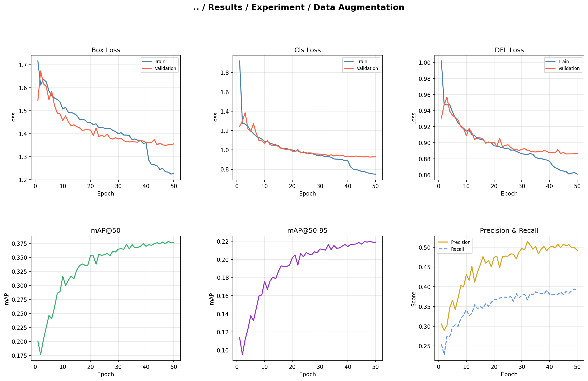

| Metric | Baseline | Data Augmentation |
|---|---|---|
| mAP@50-95 | 0.1760 | **0.1797** |
| mAP@50 | 0.3120 | **0.3165** |
| Precision | 0.4495 | **0.4511** |
| Recall | 0.3467 | **0.3521** |
| Inference (ms/img) | 5.538 | **4.430** |

#### Analysis

The data augmentation experiment produced a final mAP50-95 of 0.1797 compared to the baseline's 0.1760. A negligible difference that falls within noise. Despite the added mixup and copy-paste augmentation, the model showed no meaningful improvement in detection performance. This suggests that for the VisDrone dataset at imgsz=640, augmentation did not help the model generalize better. A likely explanation is that at 640 resolution, the small aerial objects are already so compressed that further manipulation of the images introduces noise rather than useful variation. The model already has little detail to work with, regardless of how the images are blended or rearranged.

Interestingly, the data augmentation experiment produced a notable divergence between validation and test performance. The validation-to-test gap narrowed from 26.5% to 18.2%,  a signature of successful regularization (a consistent reduction that persisted when the same augmentation was later applied at 1280 resolution). This indicates the model was less able to exploit the specific characteristics of the 548 validation images. The augmented model learned representations of the data that generalized better to unseen data, at the cost of a lower ceiling on the validation set.

### Increase Image Size

#### Experiment Settings

This experiment only changed the image resolution from 640x640 to 1280x1280. The model now has 4x as many pixels to reap information from. With this higher resolution, there should be more information for the model to process, leading to more accurate results.

#### Results

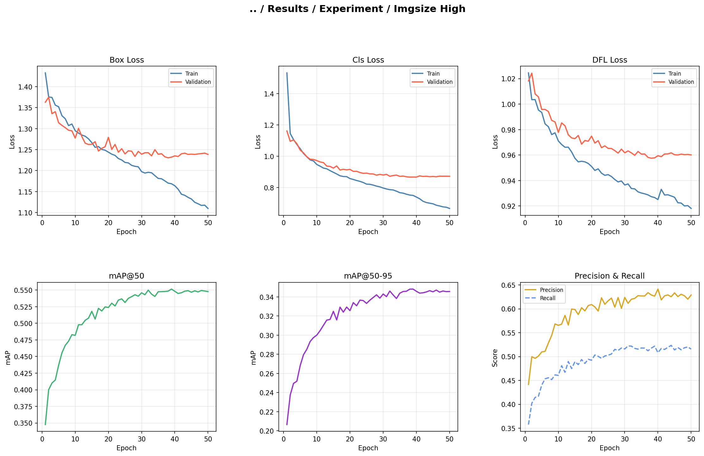

| Metric | Baseline | High Resolution (1280) |
|---|---|---|
| mAP@50-95 | 0.1760 | **0.2593** |
| mAP@50 | 0.3120 | **0.4389** |
| Precision | 0.4495 | **0.5589** |
| Recall | 0.3467 | **0.4462** |
| Inference (ms/img) | **5.538** | 5.557 |

#### Analysis

This experiment was the most impactful by far. The model achieved a test mAP@50-95 of 0.2593 and mAP@50 of 0.4389, compared to the baseline's 0.1760 and 0.3120, respectively; there was about a ~48% improvement in mAP@50-95.

This confirms that this model was simply limited by resolution on this task. The other hyperparameter solutions were trying to tune a fundamentally limited task, but the image resolution was the biggest step forward. This makes intuitive sense as well, just like us, a model will have an easier time detecting objects with a higher quality image.

The only concern with the training was the mild overfitting that appeared around epoch 20. Across all loss metrics, training loss decreases much more than the validation dataset. However, the "best" model (as defined by the highest mAP@50-95 score) occurred at epoch 39, meaning that the final model only had minor overfitting of training data as compared to epoch 50.

### Experiment Conclusion

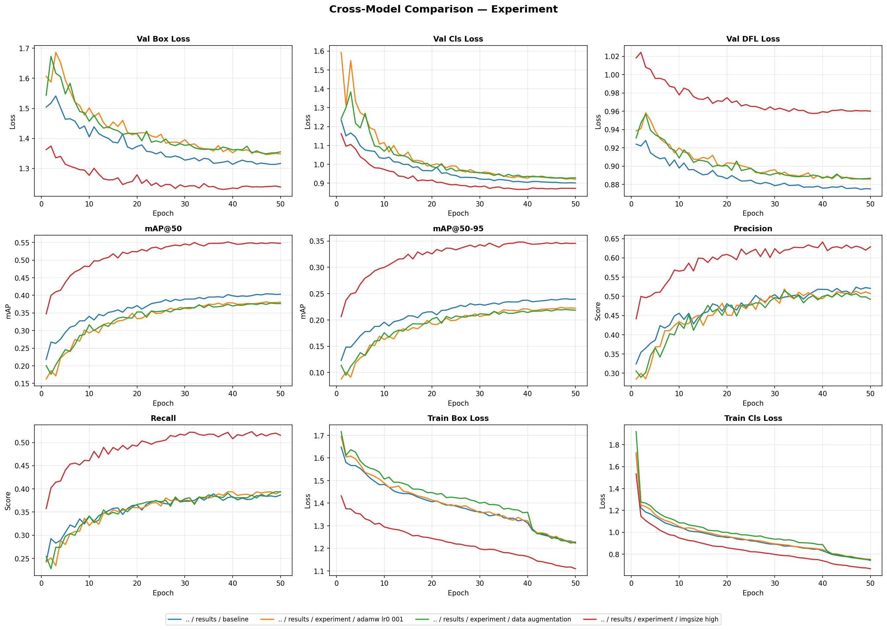

The clear frontrunner in our experiments is increasing the image size. All other experiments had similar or worse results than the baseline.

## Improvement Cycles

### Previous Experiments at High Resolution

The image size primarily limited the baseline model. Therefore, it may have been the case that previous experiments were not able to showcase their effects on such a small image size. The following experiments were trailed on the high image size as a test to see if there was any significant change.

#### Data Augmentation

##### Performance

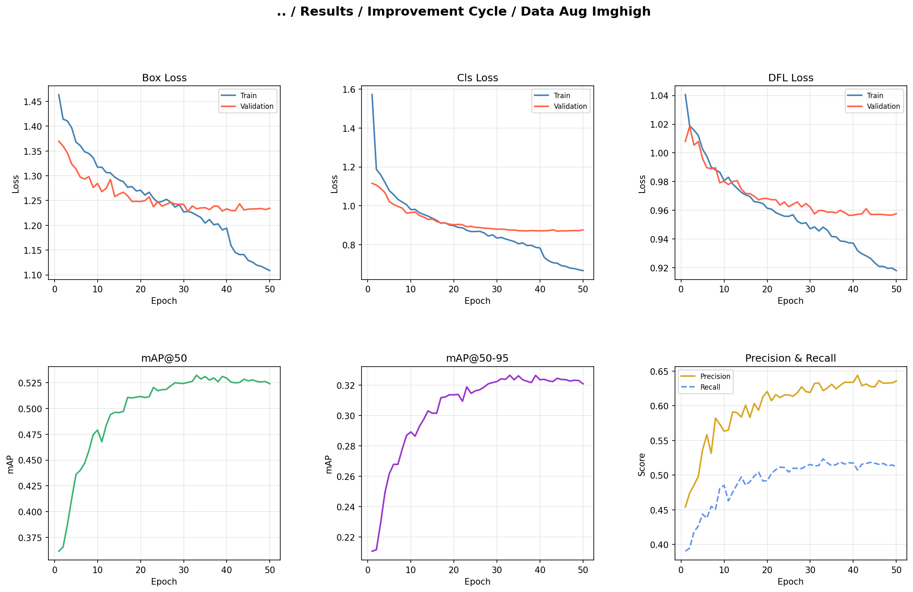

| Metric | imgsize\_high (baseline) | Data Aug + High Res |
|---|---|---|
| mAP@50-95 | **0.2593** | 0.2580 |
| mAP@50 | **0.4389** | 0.4377 |
| Precision | **0.5589** | 0.5514 |
| Recall | 0.4462 | **0.4478** |
| Inference (ms/img) | **5.557** | 5.635 |

##### Discussion

At high image resolution, the pattern observed at standard resolution is held. The high image model achieved a best validation mAP@50-95 of 0.3265, lower than the plain high image model's 0.3482, consistent with the same pattern at default image resolution. One possibility is that increasing image resolution already implicitly improves the model's exposure to fine-grained object detail, partially overlapping with what copy-paste and mixup augmentation are trying to achieve. In other words, the higher resolution may already be doing the heavy lifting in terms of feature richness, leaving less room for augmentation to add further signal. Better results may require augmentation parameters specifically tuned to VisDrone's aerial, dense-object characteristics.

What is notable is that the generalization benefit of augmentation persisted at high resolution: the val-to-test drop was 21.0% compared to imgsize_high's 25.6%, mirroring the tighter gap seen at standard resolution (18.2% augmented vs 26.5% baseline). This consistency across both image resolutions suggests the augmentation is achieving data augmentation's primary goal in reducing overfitting, but provides no performance benefit.

#### Specific Optimizer Settings

##### Performance

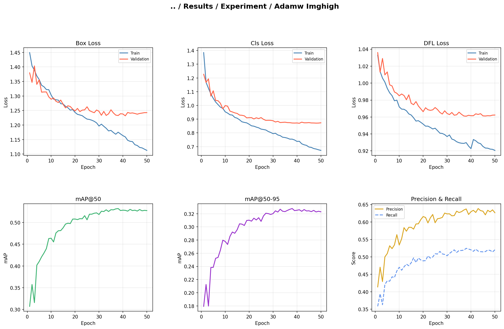

| Metric | imgsize\_high (baseline) | AdamW lr=0.001 + High Res |
|---|---|---|
| mAP@50-95 | 0.2593 | **0.2596** |
| mAP@50 | 0.4389 | **0.4414** |
| Precision | **0.5589** | 0.5554 |
| Recall | 0.4462 | **0.4572** |
| Inference (ms/img) | **5.557** | 5.624 |

##### Discussion

This model led to a mAP@50-95 of 0.2596, beating the baseline's 0.176 by 0.0836. Although this may be noise, the same optimizer settings were the leading model in the default image quality as well. This suggests that the optimizer may lead to improvements, but these gains may fall within the threshold of noise.

Interestingly, while the validation mAP@50-95 of the model (0.3278) was significantly lower than the high image resolution model (0.3482), both models performed nearly identically on the test set (0.2596 vs 0.2593), a difference of just 0.0003. This suggests that despite underperforming on validation, the model generalized comparably to unseen data. A possibility is that the high image resolution model overfitted to the validation set of ~550 images, inflating its validation without translating to any actual gain in the actual problem space, as evidenced by its near-identical test on the ~1,600 image test set.

#### Epoch Control

##### Justification of Change

When considering epochs, there is an opportunity to either increase or decrease epochs. For completeness sake, both cases were tried. In the first image size model, there were signs of mild overfitting at the beginning of epoch 20, so the model at that stage was benchmarked to see performance at a mild underfit/fitted model. For the increase case, the higher image resolution model was run to epoch 75.

##### Performance

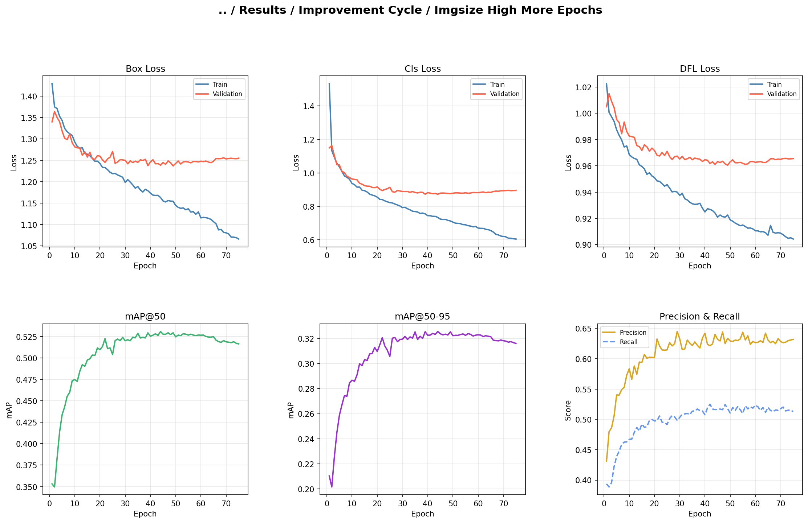

| Metric | imgsize\_high (50 ep) | More Epochs (75 ep) | Fewer Epochs (20 ep) |
|---|---|---|---|
| mAP@50-95 | **0.2593** | 0.2538 | 0.2511 |
| mAP@50 | **0.4389** | 0.4320 | 0.4266 |
| Precision | **0.5589** | 0.5570 | 0.5379 |
| Recall | **0.4462** | 0.4437 | 0.4391 |
| Inference (ms/img) | 5.557 | **5.522** | 5.755 |

##### Discussion

In the high epoch model, there were signs of severe overfitting, as we would expect. The best model actually occurred at epoch 44, which is below the original limit of 50. This showcases that the original high-resolution model already converged, and further training was unnecessary. In fact, the extra training actively degraded generalization performance. One theory on why more epochs might have underperformed, even though it converged under 50 epochs, is that it is due to the different training dynamics. Learning rate decreases as training goes on, so while the original model was able to decrease and fine-tune in epochs 40-50, the high epoch was still making big strides when it hit its best performance, hence it settled in an un-optimal place.
For the epoch 20 model, we saw a measurable performance decrease compared to the full 50-epoch run. At epoch 20, the validation mAP@50-95 was 0.3256 versus the 50-epoch peak of 0.3482, confirming the model had not yet fully converged. This translated to a test set mAP@50-95 of 0.2511, the lowest of the three epoch variants. This suggests that epoch 20 represents a genuinely underfitted state; the model had not extracted enough signal from the training data to generalize well, and the mild overfitting visible at epoch 20 was not yet a concern.

#### Cosine Learning Rate

##### Justification of Change

The baseline model utilizes a linear learning rate decay. This means that the learning rate decreases at a constant rate across all epochs. This improvement cycle seeks to implement a cosine annealing schedule, where the learning rate decays as a cosine curve. Meaning that the rate drops slowly, then accelerates through the middle, and tapers gently towards the end. The reasoning with this approach is that the model gains more time to explore the loss area, before smoothly settling into a fine-tuning phase when near convergence. This technique has been shown in other object detection tasks to squeeze some better results out of a model.

##### Performance

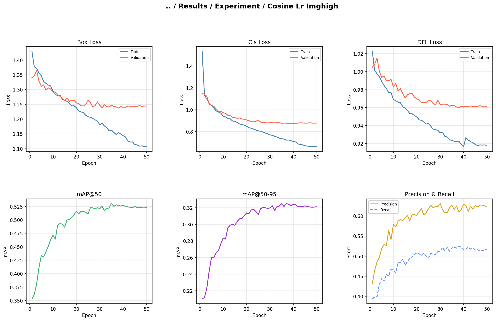

| Metric | imgsize\_high (baseline) | Cosine LR |
|---|---|---|
| mAP@50-95 | **0.2593** | 0.2550 |
| mAP@50 | **0.4389** | 0.4324 |
| Precision | **0.5589** | 0.5490 |
| Recall | 0.4462 | **0.4465** |
| Inference (ms/img) | 5.557 | **5.501** |

##### Discussion
The cosine learning rate did not improve performance. There are a couple of reasons for this behavior. The first reason is that since the YOLO model is already a pre-trained model and linear learning rate serves as its default, this may have already been tested and tuned as the best, and cosine scheduling offered no meaningful advantage. Another option is that, as shown in the previous experiments, the model is already hitting a similar performance no matter what parameters are turned on. If cosine is good at exploring more possibilities, it may be that there are no other actual possibilities to explore except the valley that we keep ending in.

##### Conclusion

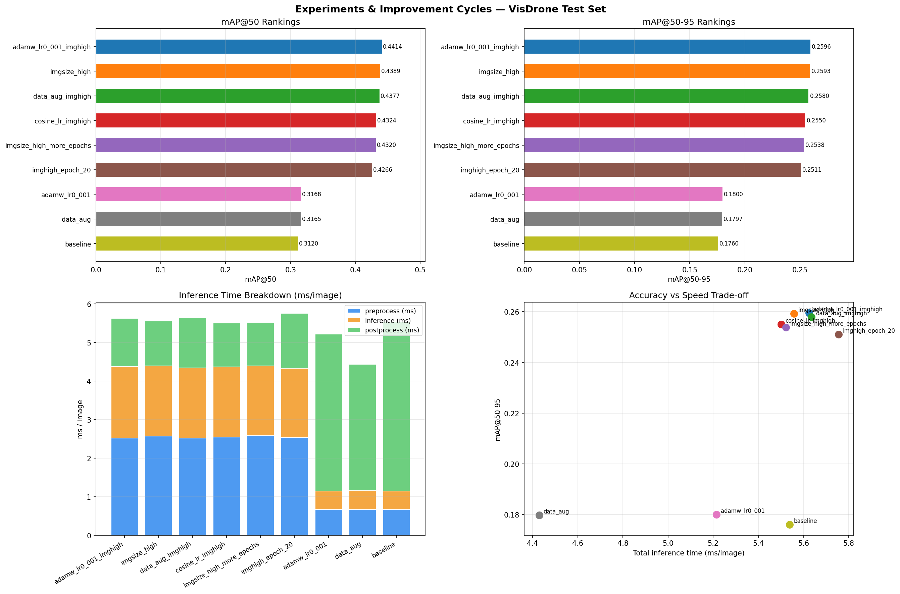

The experiments done support one central claim: the most important factor for YOLO performance on this task is image resolution. Every other hyperparameter had a slight to no effect on the model's performance, and this is most clearly illustrated by the two distinct clusters in the results, standard resolution models (640) grouped around a test mAP@50-95 of 0.176-0.180, while high resolution models (1280) grouped around 0.251-0.260, with the only difference between the clusters being image size. The optimizer experiment showed a marginal gain of 0.0039 mAP@50-95 over baseline, well within noise. Data augmentation produced a near-identical result at 0.0037 above baseline, and while it consistently reduced the gap between validation and test performance across both resolutions, it provided no meaningful accuracy improvement. The image size experiment was the outlier, producing a ~48% improvement in mAP@50-95 over the baseline. The improvement cycles confirmed that these patterns held at high resolution. Epoch control confirmed the original 50-epoch high-resolution model had already converged optimally, and cosine learning rate scheduling offered no meaningful advantage.

It is worth noting that despite the gains from higher resolution, even the best-performing model achieved a test mAP@50-95 of 0.2596, meaning the model still struggles to localize the majority of objects in the scene precisely. Image resolution was the largest lever available in these experiments, but the task itself remains far from solved.

## Versioned Analysis

The baseline model, YOLOv11s, was benchmark with YOLOv9s, YOLOv10s, YOLOv11s. The following figures and tables showcase their results.

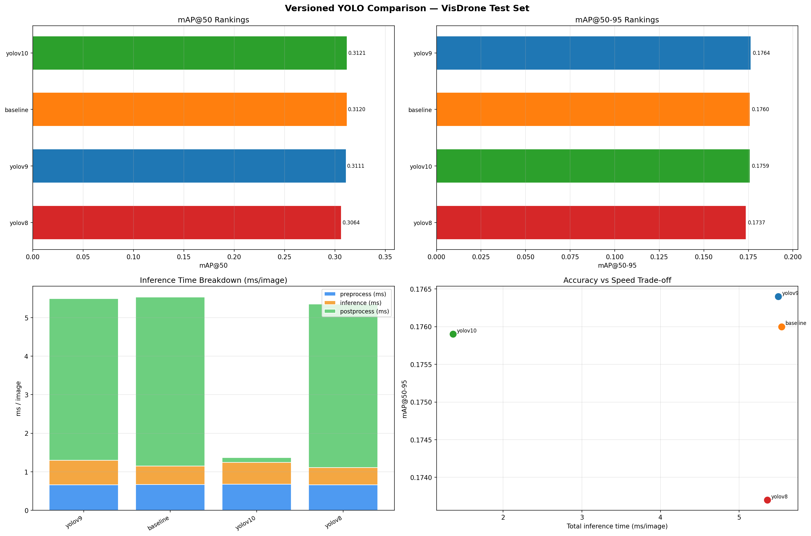

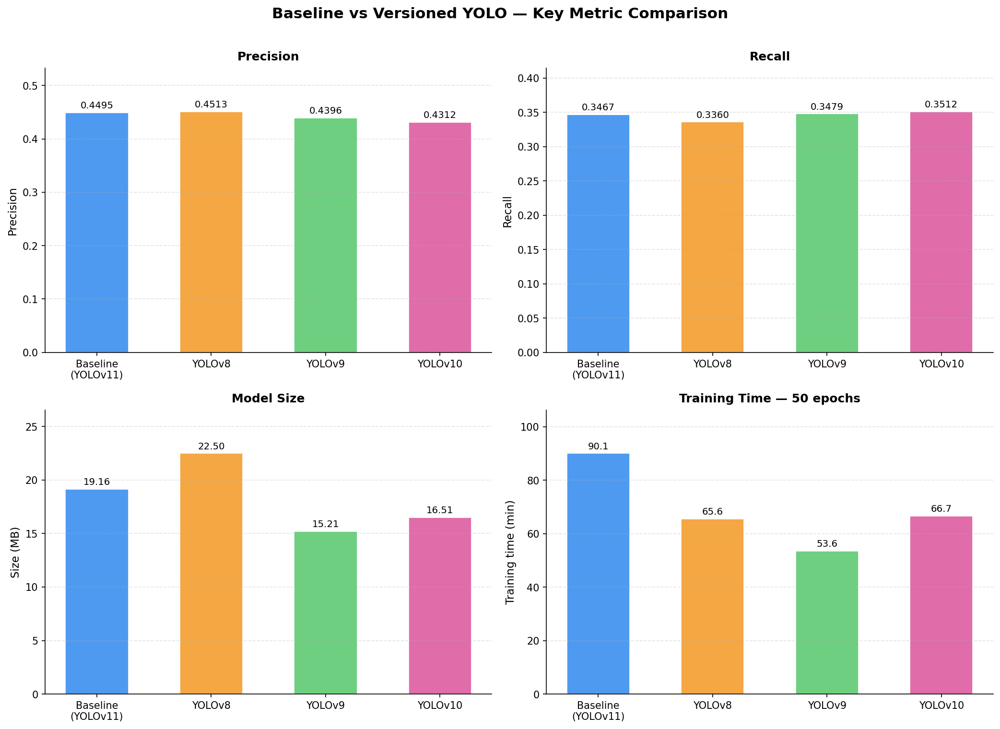

| Model | mAP@50-95 | mAP@50 | Precision | Recall | Params (M) | Training Time | Inference (ms/img) |
|---|---|---|---|---|---|---|---|
| YOLOv8s | 0.1737 | 0.3064 | **0.4513** | 0.3360 | 11.2 | 1.1h | 5.355 |
| YOLOv9s | **0.1764** | 0.3111 | 0.4396 | 0.3479 | **7.1** | **0.9h** | 5.495 |
| YOLOv10s | 0.1759 | **0.3121** | 0.4312 | **0.3512** | 7.2 | 1.1h | **1.363** |
| YOLOv11s | 0.1760 | 0.3120 | 0.4495 | 0.3467 | 9.4 | 1.5h | 5.538 |

While YOLOv9 technically holds a slight edge in overall accuracy, YOLOv10 leads in both inference speed and mAP@50 rankings. In practice, the differences in mAP@50, recall, and precision between these models are so marginal that their overall performance is virtually identical. The only truly tangible improvement comes from YOLOv10's heavily reduced inference latency. By employing an NMS-free architecture, YOLOv10 successfully eliminates post-processing delays without sacrificing accuracy, making it the recommended model for general deployment.
However, specialized scenarios may call for different approaches. For example, YOLOv9 features the smallest model footprint and the fastest training time, making it the most efficient choice for resource-constrained environments.
If you are deploying for real-time inference and timing is critical, use YOLOv10. If you are training on limited hardware or need a lightweight model, use YOLOv9. Otherwise, the performance between these models all comes down to noise-level differences.

## Conclusion
Across everything tried in this report, the only change to make significant gains was image quality. This makes intuitive sense. A pre-trained image model is already excellent at detecting objects in images. There is no special hyperparameter hacking that will yield significant gains. Rather, the single most important factor is just how much detail an image has. That said, there are some limitations presented in this report. The model is fundamentally limited by only ~6,500 training images for a complex detection task. With more data, we could push accuracy further. This report only tried resolutions of 640 and 1280. A natural next step would be if the pattern holds for 1920 or higher, and where a point of diminishing returns would be. Lastly, this report utilized the small YOLO models. It is yet to be seen if this pattern holds for larger model variants with greater capacity.
